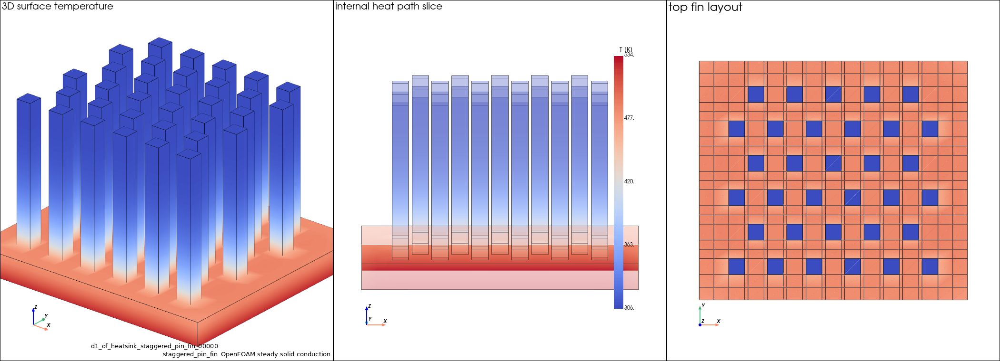

# Preliminary Report: Original GeoPT Checkpoint Transfer in OpenFOAM-Solved Heat-Sink Conduction

Date: 2026-05-11
Repository: `OzasaHiro/thermal-geopt`
Status: preliminary technical report, not a peer-reviewed paper

## Summary

This experiment started as an attempt to adapt GeoPT's dynamics-lifted
geometric pre-training idea to heat-transfer surrogate modeling.  The most
interesting finding so far is different from the initial plan:

> In this repository's preliminary OpenFOAM-solved heat-sink conduction tests, a
> Transolver initialized from shape-compatible tensors of the original GeoPT
> checkpoint obtains lower test error than scratch training at 25- and 50-case
> low-data settings.

Within two generated OpenFOAM-solved heat-sink solid-conduction benchmarks and
three data split seeds per setting, the partially loaded original GeoPT
checkpoint improved mean Relative L2 for each recorded data-split aggregate
under 25- and 50-training-case regimes.  Individual test cases were not
uniformly improved.  The current project-local thermal-specific pretraining
prototype, internal ID `R4`, did not help; it caused negative transfer.

The original checkpoint was pre-trained with dynamics-lifted self-supervision on
off-the-shelf car, airplane, and watercraft geometry subsets.  It was not
pre-trained on thermal labels.

This is consistent with the original GeoPT paper's broader cross-regime framing
and supports a narrower repository-local hypothesis:

> A partially transferred original GeoPT initialization can be useful for an
> OpenFOAM-solved solid-conduction setting not evaluated in the original paper.

## What Was Tested

### Downstream Task

The downstream task is steady solid conduction, solved with OpenFOAM Foundation
v13 `laplacianFoam`.

For each case:

- a 3D heat-sink-like solid geometry is generated;
- the base is the heat source or hot boundary;
- the exterior is the cooling boundary;
- OpenFOAM solves the scalar temperature field `T`;
- the result is converted to NPZ with point coordinates, condition features,
  and cell-centered temperature labels;
- a Transolver backbone predicts temperature from point-wise inputs.

This is solver-generated data.  It is not the earlier synthetic proxy dataset.
The task should be interpreted as a controlled solid-conduction surrogate
benchmark, not a physically complete heat-sink cooling model.  Boundary
condition types, source/sink value ranges, material assumptions, and feature
encodings are defined by the generation scripts.

### Benchmarks

Two geometry-varied solid-conduction benchmarks were used.

| Benchmark | Cases | Families | Test cases | Purpose |
|---|---:|---|---:|---|
| Benchmark A, internal ID `M4` | 300 | `plate_fin`, `pin_fin` | 45 | first OpenFOAM-solved heat-sink benchmark |
| Benchmark B, internal ID `M5` | 300 | `plate_fin`, `pin_fin`, `staggered_pin_fin` | 45 | more complex heat-sink benchmark and visualization target |

Both use low-data splits at 25 and 50 training cases, with data split seeds
`42`, `43`, and `44`.

The internal dataset label `D1` refers to this project's first OpenFOAM-solved
solid-conduction dataset family: generated heat-sink-like blockMesh geometries
with steady scalar-conduction labels.  It does not mean a one-dimensional
physical problem.

### Compared Groups

| Group | Meaning |
|---|---|
| `scratch` | same downstream architecture, random initialization |
| `geopt_original` | original GeoPT pretrained checkpoint, `../GeoPT/checkpoints/GeoPT_8layers.pt` |
| `geopt_transport_lifted` | project-local thermal-specific pretraining prototype, internal ID `R4` |

The original GeoPT checkpoint loads shape-compatible backbone tensors into the
downstream Transolver.  Input/output tensors with incompatible shapes are
skipped.
Checkpoint transfer is partial and shape-matched.  In the runs for internal IDs
`M4` and `M5`, original GeoPT loaded 166 compatible tensors and skipped/missed
`preprocess.linear_pre.0.weight` plus the final prediction head
`blocks.7.mlp2.{weight,bias}`.  The thermal-specific prototype loaded 167
tensors and skipped/missed only `blocks.7.mlp2.{weight,bias}`.  Thus the final
temperature prediction head was trained downstream for both pretrained groups,
and the original GeoPT input projection was only partially transferred.

## Main Results

Values are mean +/- standard deviation over split seeds `42`, `43`, and `44`
unless otherwise noted.  All runs used downstream training seed `42`, so the
intervals represent split-level variability, not full training stochasticity or
paper-level confidence intervals.

### Benchmark A: Heat-Sink Solid Conduction, Internal ID `M4`

Test Relative L2:

| Training cases | Scratch | Thermal prototype (`R4`) | Original GeoPT |
|---:|---:|---:|---:|
| 25 | 0.013122 +/- 0.000685 | 0.037595 +/- 0.001770 | 0.011370 +/- 0.001009 |
| 50 | 0.010674 +/- 0.000470 | 0.022637 +/- 0.000570 | 0.008840 +/- 0.000345 |

Paired improvement vs scratch:

Paired improvement is computed per split seed against the scratch run using the
same train/test split: `(scratch Relative L2 - group Relative L2) / scratch
Relative L2`.  Negative values indicate higher error than scratch.

| Training cases | Thermal prototype (`R4`) | Original GeoPT |
|---:|---:|---:|
| 25 | -187.1% | +13.4% |
| 50 | -112.4% | +17.2% |

Temperature extrema and hotspot-temperature metrics:

| Training cases | Group | max-temperature absolute error [K] | hotspot-temperature absolute error [K] |
|---:|---|---:|---:|
| 25 | scratch | 2.64 | 2.74 |
| 25 | original GeoPT | 1.98 | 2.00 |
| 50 | scratch | 1.14 | 1.24 |
| 50 | original GeoPT | 0.99 | 1.00 |

### Benchmark B: Complex Heat-Sink Solid Conduction, Internal ID `M5`

Test Relative L2:

| Training cases | Scratch | Thermal prototype (`R4`) | Original GeoPT |
|---:|---:|---:|---:|
| 25 | 0.012548 +/- 0.000259 | 0.032063 +/- 0.001846 | 0.011186 +/- 0.000006 |
| 50 | 0.010613 +/- 0.000060 | 0.022536 +/- 0.002766 | 0.008950 +/- 0.000194 |

Paired improvement vs scratch:

| Training cases | Thermal prototype (`R4`) | Original GeoPT |
|---:|---:|---:|
| 25 | -155.5% | +10.8% |
| 50 | -112.3% | +15.7% |

Temperature extrema and hotspot-temperature metrics:

| Training cases | Group | max-temperature absolute error [K] | hotspot-temperature absolute error [K] |
|---:|---|---:|---:|
| 25 | scratch | 2.88 | 2.93 |
| 25 | original GeoPT | 1.44 | 1.44 |
| 50 | scratch | 1.12 | 1.14 |
| 50 | original GeoPT | 0.93 | 0.91 |

## Interpretation

The two benchmark results point in the same direction:

- Original GeoPT improves OpenFOAM-solved heat-sink conduction prediction under
  low-data fine-tuning.
- The improvement appears in Relative L2 and also in max-temperature and
  hotspot-temperature metrics.
- The current project-local thermal-specific pretraining prototype, internal ID
  `R4`, is not a useful initialization for this downstream task.

This is important because it is consistent with GeoPT's broader cross-regime
framing beyond fluid-only prediction.  A plausible interpretation is that the
original checkpoint provides useful boundary-aware spatial organization and
transport-like geometry-dynamics correlations learned from the GeoPT pretext
task:

- spatial organization of 3D point sets;
- boundary-aware representation;
- transport-like geometry-dynamics correlations from the synthetic-velocity
  pretext task;
- reusable initialization for neural PDE surrogate tasks.

This experiment does not identify which part of the checkpoint causes transfer;
the boundary-aware geometry-dynamics representation interpretation is a
plausible explanation, not an ablation-proven mechanism.

The negative result for the thermal-specific prototype is also useful, but it
should be read narrowly.
It shows that this heat-themed pretext task is not automatically aligned with
this downstream task.  It should not be interpreted as a controlled ablation of
the learned representation in the original GeoPT checkpoint.

### Original GeoPT vs Thermal-Specific Prototype Pretraining

The comparison should not be read as a rejection of the Thermal GeoPT concept.
The two pretrained initializations are very different in scale and construction.

Original GeoPT was trained at much larger scale: the paper reports more than
one million solver-free pretraining samples from diverse off-the-shelf
geometries, specifically car, airplane, and watercraft subsets, with
dynamics-lifted geometric self-supervision.  Its target is not thermal
conduction itself; it is a generic geometry-dynamics pretext task.

The current project-local thermal-specific pretraining prototype, internal ID
`R4`, is much smaller and uses narrower geometry families and a more specific
synthetic target.  Its negative transfer therefore says that this particular
design and scale are not yet aligned with the downstream task.  It does not show
that thermal-specific GeoPT pretraining is impossible or intrinsically
unhelpful.

For this preliminary report, the most actionable observation is the positive
checkpoint-transfer result from original GeoPT, while the `R4` result is best
treated as a negative result for one small thermal-specific prototype.  The
checkpoint used here was not trained with thermal labels, yet it improves
OpenFOAM-solved heat conduction.  Combined with the original GeoPT paper's report
that the same lifted geometric pretraining benefits both fluid and solid
mechanics benchmarks, this result is compatible with the broader GeoPT
hypothesis.  It should still be treated as preliminary evidence from a small
conduction benchmark suite.

Any future thermal extension should be described separately from the current
evidence.  The present report only claims the observed checkpoint-transfer
result.

## Visual Example

For communication, the best current figure is a 3D heat-sink surface plus an
internal temperature cut plane.  The weak-cooling case is separate from the
quantitative benchmark datasets, internal IDs `M4` and `M5`, and is intended
only as an explanatory visualization.



Generate the visualization case:

```bash
../../.venv/bin/python scripts/generate_d1_openfoam_heatsink_cases.py \
  --case-count 1 \
  --families staggered_pin_fin \
  --cells-x 20 \
  --cells-y 20 \
  --base-cells-z 4 \
  --feature-cells-z 12 \
  --source-temperature-min 520 \
  --source-temperature-max 560 \
  --sink-temperature-min 295 \
  --sink-temperature-max 305 \
  --sink-value-fraction 0.025 \
  --raw-dir data/downstream_raw/d1_openfoam_visual_staggered_pin_weak_cooling \
  --output-dir data/downstream_npz/d1_openfoam_visual_staggered_pin_weak_cooling \
  --overwrite
```

Render the figure:

```bash
../../.venv/bin/python scripts/render_d1_surface_temperature.py \
  --manifest data/downstream_npz/d1_openfoam_visual_staggered_pin_weak_cooling/manifest.json \
  --family staggered_pin_fin \
  --max-cases 1 \
  --output-dir outputs/figures/m5_visual_weak_cooling_surface_temperature \
  --camera-zoom 0.9
```

## Reproduction Commands

### Generate Benchmark A Data, Internal ID `M4`

```bash
OVERWRITE=1 CASE_COUNT=300 bash scripts/run_m4_openfoam_heatsink_d1.sh
```

### Run Benchmark A Transfer Evaluation

```bash
TRAIN_SIZES="25 50" SPLIT_SEEDS="42 43 44" EPOCHS=50 MODE=all \
  bash scripts/run_m4_heatsink_transfer_gate.sh
```

### Generate Benchmark B Data, Internal ID `M5`

```bash
OVERWRITE=1 bash scripts/run_m5_openfoam_complex_heatsink_d1.sh
```

### Run Benchmark B Transfer Evaluation

```bash
TRAIN_SIZES="25 50" SPLIT_SEEDS="42 43 44" EPOCHS=50 MODE=all \
  bash scripts/run_m5_complex_heatsink_transfer_gate.sh
```

## Artifacts

The main output files are:

- `docs/m4_heatsink_transfer_results.md`
- `docs/results/m4_heatsink_transfer_summary.json`
- `docs/m5_complex_heatsink_transfer_results.md`
- `docs/results/m5_complex_heatsink_transfer_summary.json`
- `docs/assets/figures/m5_weak_cooling_surface_temperature.png`

Large artifacts such as OpenFOAM case directories, NPZ datasets, checkpoints,
full logs, and bulk generated figures are ignored by default in Git.  The
repository keeps only selected lightweight result summaries and one
communication figure.
The lightweight JSON summaries are the primary audit trail for the reported
tables.  Full OpenFOAM cases, NPZ datasets, logs, and checkpoints are
intentionally excluded from Git; an archival release should attach these
separately if exact numerical auditability is required.

## Limitations

This is not a final paper-level claim.

- Only 3 split seeds were used.
- Only one downstream training seed, `42`, was used; the reported variation is
  split-level variation, not optimizer stochasticity.
- The downstream task is solid conduction, not conjugate heat transfer.
- The pin-fin geometry is blockMesh-friendly and rectangularized, not a fully
  resolved industrial heat sink.
- The original GeoPT checkpoint is used as an external pretrained control and
  is not redistributed by this report.
- The original GeoPT and project-local thermal-specific pretraining runs differ
  substantially in data scale, geometry diversity, and pretraining target, so
  the `R4` negative result is not a controlled ablation of the Thermal GeoPT
  concept.
- The `R4` negative transfer could reflect pretraining scale, target alignment,
  normalization, optimizer schedule, checkpoint selection, or downstream
  fine-tuning recipe.  It should be interpreted as a failure of this `R4` transfer
  recipe, not as evidence against thermal-specific pretraining.
- The negative result for internal ID `R4` applies to the current pretraining
  design, not to every possible thermal-specific GeoPT extension.
- Reproduction requires OpenFOAM Foundation v13, the project Python
  environment, and an external original GeoPT checkpoint at
  `../GeoPT/checkpoints/GeoPT_8layers.pt`.  Because the checkpoint and generated
  datasets are not redistributed, this repository supports script-level
  reproduction but not fully self-contained artifact reproduction.

## Recommended Public Claim

Use a cautious statement:

> In preliminary OpenFOAM-solved heat-sink solid-conduction benchmarks, a
> Transolver initialized from shape-compatible tensors of the original GeoPT
> checkpoint improves mean Relative L2 over scratch training by about 10-17% at
> 25- and 50-training-case settings and improves max-temperature and
> hotspot-temperature errors.  A small project-local thermal-specific
> pretraining prototype, internal ID `R4`, shows negative transfer under the
> same evaluation protocol.  These results are preliminary checkpoint-transfer
> evidence, not a controlled ablation of the full Thermal GeoPT concept.

This is suitable for a GitHub technical report with clear preliminary-status
caveats.
